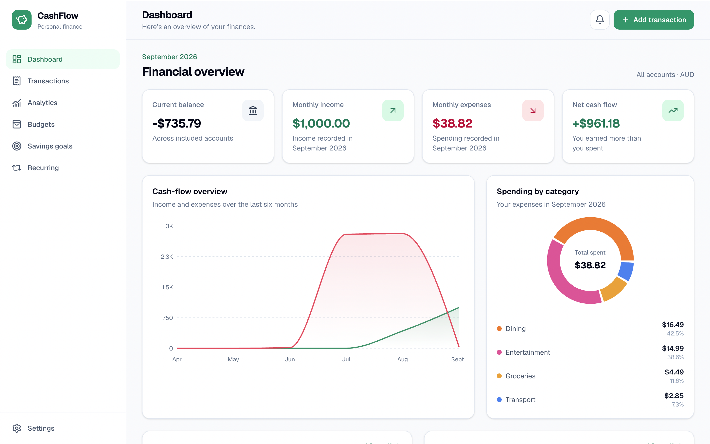
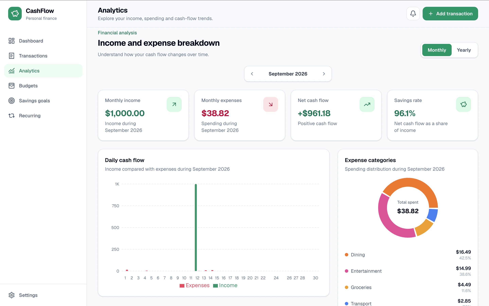
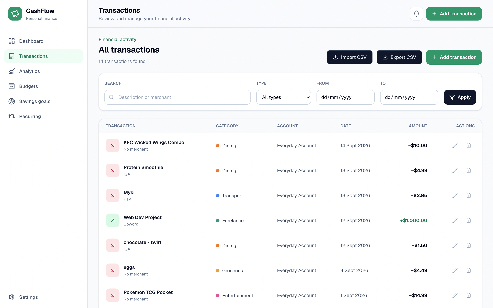
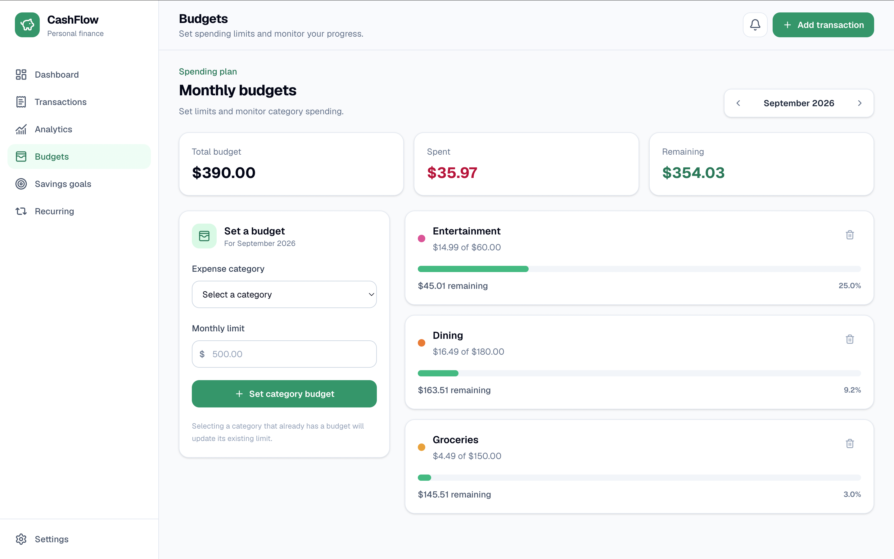
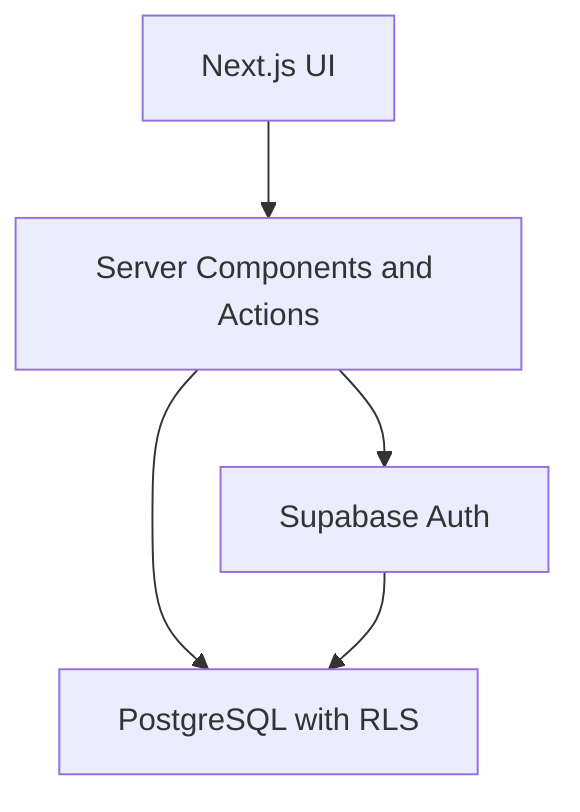

# CashFlow

[](https://github.com/Jaydenlaoyx/cashflow/actions/workflows/ci.yml)

CashFlow is a responsive personal-finance application for tracking income, expenses, budgets, savings goals and recurring transactions.

It turns transaction data into clear monthly and yearly visualisations, helping users understand where their money comes from, where it goes and how they are progressing toward their financial goals.

[View live application](https://cashflow-flame-one.vercel.app/)



## Features

### Transactions

- Record income and expenses
- Edit and delete existing transactions
- Search transaction descriptions
- Filter by transaction type, category, account and date
- Paginated desktop and mobile transaction views
- Import transactions from CSV
- Export transaction history to CSV
- Validate CSV data before importing
- Prevent accidental duplicate CSV imports

### Dashboard and analytics

- Current account balance
- Monthly income and expenditure totals
- Net cash-flow calculation
- Income-versus-expense charts
- Spending breakdown by category
- Daily cash-flow visualisation
- Monthly and yearly reporting modes
- Period navigation for historical analysis
- Recent-transaction overview

### Budgeting

- Set monthly category budgets
- Compare spending against budget limits
- Display remaining amounts and overspending
- Navigate between budgeting months
- Track overall monthly budget progress

### Savings goals

- Create goals with target amounts and dates
- Record contributions
- Track completion progress
- Calculate suggested monthly contributions
- Display active goals on the dashboard

### Recurring transactions

- Create recurring income and expenses
- Weekly, fortnightly, monthly and yearly frequencies
- Pause and resume schedules
- Process due transactions
- Idempotent generation to prevent duplicate occurrences

### Accounts and categories

- Create and manage financial accounts
- Include or exclude accounts from the current balance
- Archive and restore accounts
- Create custom income and expense categories
- Archive unused categories
- Protect categories referenced by active schedules

### Authentication and security

- Email and password registration
- Email confirmation
- Protected dashboard routes
- Secure server-side authentication
- PostgreSQL Row Level Security
- Per-user data isolation
- Server-side ownership validation
- Restricted internal database functions

### Progressive Web App

- Responsive mobile and desktop design
- Installable web app manifest
- Branded application icons
- Apple home-screen support
- Privacy-safe service worker
- Offline fallback without caching financial data
- Light and dark interface support

## Screenshots

### Analytics



### Transactions



### Budgets and savings goals



## Technology stack

| Area | Technology |
| --- | --- |
| Framework | Next.js App Router |
| Language | TypeScript |
| UI | React and Tailwind CSS |
| Database | PostgreSQL through Supabase |
| Authentication | Supabase Auth |
| Security | Row Level Security |
| Charts | Recharts |
| Forms and validation | React Hook Form and Zod |
| CSV parsing | Papa Parse |
| Icons | Lucide React |
| Testing | Vitest |
| CI | GitHub Actions |
| Deployment | Vercel |
| PWA | Web App Manifest and Service Worker |

## Architecture



The browser never receives elevated database credentials. Server Components, Server Actions and Route Handlers use the authenticated Supabase session, while Row Level Security independently enforces data ownership inside PostgreSQL.

## Security model

Every user-owned table has Row Level Security enabled:

- `profiles`
- `accounts`
- `categories`
- `transactions`
- `budgets`
- `savings_goals`
- `goal_contributions`
- `recurring_transactions`

Policies restrict reads and writes using the authenticated user ID. Insert and update policies also use `WITH CHECK` conditions to prevent ownership reassignment.

Internal registration functions:

- Use an empty PostgreSQL `search_path`
- Fully qualify referenced database objects
- Are inaccessible to anonymous and authenticated API callers
- Run with elevated privileges only when invoked internally

The PWA service worker caches only public icons and manifest files. Authenticated pages, API responses, Supabase requests and financial data are never placed in offline storage.

## Getting started

### Prerequisites

- Node.js 24 or later
- npm
- A Supabase project
- Supabase CLI, if applying migrations from the terminal

### Installation

Clone the repository:

```bash
git clone https://github.com/Jaydenlaoyx/cashflow.git
cd cashflow
```

Install dependencies:

```bash
npm install
```

Create a local environment file:

```bash
cp .env.example .env.local
```

Add your Supabase project configuration:

```env
NEXT_PUBLIC_SUPABASE_URL=your_supabase_project_url
NEXT_PUBLIC_SUPABASE_PUBLISHABLE_KEY=your_supabase_publishable_key
NEXT_PUBLIC_SITE_URL=http://localhost:3000
```

Never expose a Supabase service-role key in a variable beginning with `NEXT_PUBLIC_`.

### Database setup

Apply the SQL migrations from:

```text
supabase/migrations
```

Using the Supabase CLI:

```bash
npx supabase login
npx supabase link --project-ref YOUR_PROJECT_REFERENCE
npx supabase db push
```

Alternatively, run the migrations in chronological order through the Supabase SQL Editor.

Generate the database TypeScript definitions:

```bash
npx supabase gen types typescript \
  --project-id YOUR_PROJECT_REFERENCE \
  --schema public \
  > /tmp/cashflow-database.ts
```

Confirm that the temporary file is valid before replacing the existing definitions:

```bash
grep -n "export type Database" /tmp/cashflow-database.ts
mv /tmp/cashflow-database.ts src/types/database.ts
```

### Run locally

```bash
npm run dev
```

Open:

```text
http://localhost:3000
```

## Available scripts

| Command | Purpose |
| --- | --- |
| `npm run dev` | Start the development server |
| `npm run build` | Create a production build |
| `npm run start` | Start the production server |
| `npm run lint` | Run ESLint |
| `npm run test` | Run Vitest in watch mode |
| `npm run test:run` | Run the test suite once |
| `npm run generate:icons` | Generate PWA icon assets |

## Testing

Run automated tests:

```bash
npm run test:run
```

Run all local quality checks:

```bash
npm run test:run
npm run lint
npm run build
```

GitHub Actions performs these checks automatically for pushes and pull requests.

Current automated coverage focuses on CSV transaction validation, including:

- Valid income and expense rows
- Required fields
- Invalid transaction types
- Positive amount requirements
- ISO date validation
- Impossible calendar dates
- Leap-year handling

## CSV format

CashFlow accepts CSV files containing these required columns:

```csv
Date,Type,Description,Category,Account,Amount,Notes
2026-09-01,expense,Groceries,Groceries,Everyday Account,75.50,Weekly shop
2026-09-02,income,Salary,Salary,Everyday Account,2500.00,
```

Rules:

- Dates must use `YYYY-MM-DD`.
- Type must be `income` or `expense`.
- Amount must be greater than zero.
- Account and category names must already exist.
- The category type must match the transaction type.
- A maximum of 1,000 rows can be imported at once.

## Deployment

The application is deployed on Vercel and connected to Supabase.

Required Vercel environment variables:

```env
NEXT_PUBLIC_SUPABASE_URL=
NEXT_PUBLIC_SUPABASE_PUBLISHABLE_KEY=
NEXT_PUBLIC_SITE_URL=
```

The production URL and authentication callback must also be added to the Supabase Auth URL configuration.

## Key engineering decisions

### Database-level user isolation

Security is enforced in PostgreSQL rather than relying only on application queries. Even if a client request is modified, Row Level Security prevents access to another user’s records.

### Server-side financial mutations

Transaction, budget, goal, account and recurring-schedule mutations are handled through Server Actions. Each action validates authentication and verifies referenced records before writing.

### Idempotent recurring processing

Generated recurring transactions include their source schedule and occurrence date. A database uniqueness rule prevents the same scheduled occurrence from being generated more than once.

### Safe CSV processing

CSV files are parsed and previewed in the browser for immediate feedback, then validated again on the server. Accounts and categories are resolved against records accessible to the authenticated user before insertion.

### Privacy-safe offline behavior

The service worker intentionally avoids caching authenticated application pages. When offline, CashFlow displays a generic fallback rather than stale or sensitive financial information.

## Project status

CashFlow currently includes all planned core personal-finance features and is deployed as an installable responsive web application.

### Potential future improvements

- Open Banking integration through an accredited provider
- Transaction reconciliation and duplicate suggestions
- Transfers between accounts
- Notifications for budgets and recurring payments
- Additional automated component and end-to-end tests
- Native packaging with Capacitor
- Multi-currency conversion
- Shared household budgets

Bank integration is intentionally not implemented directly with banking credentials. A production implementation would use an accredited Open Banking or Consumer Data Right provider.

## Author

**Jayden Lao**

- [Portfolio](https://jayden-portfolio-snowy.vercel.app/)
- [GitHub](https://github.com/Jaydenlaoyx)